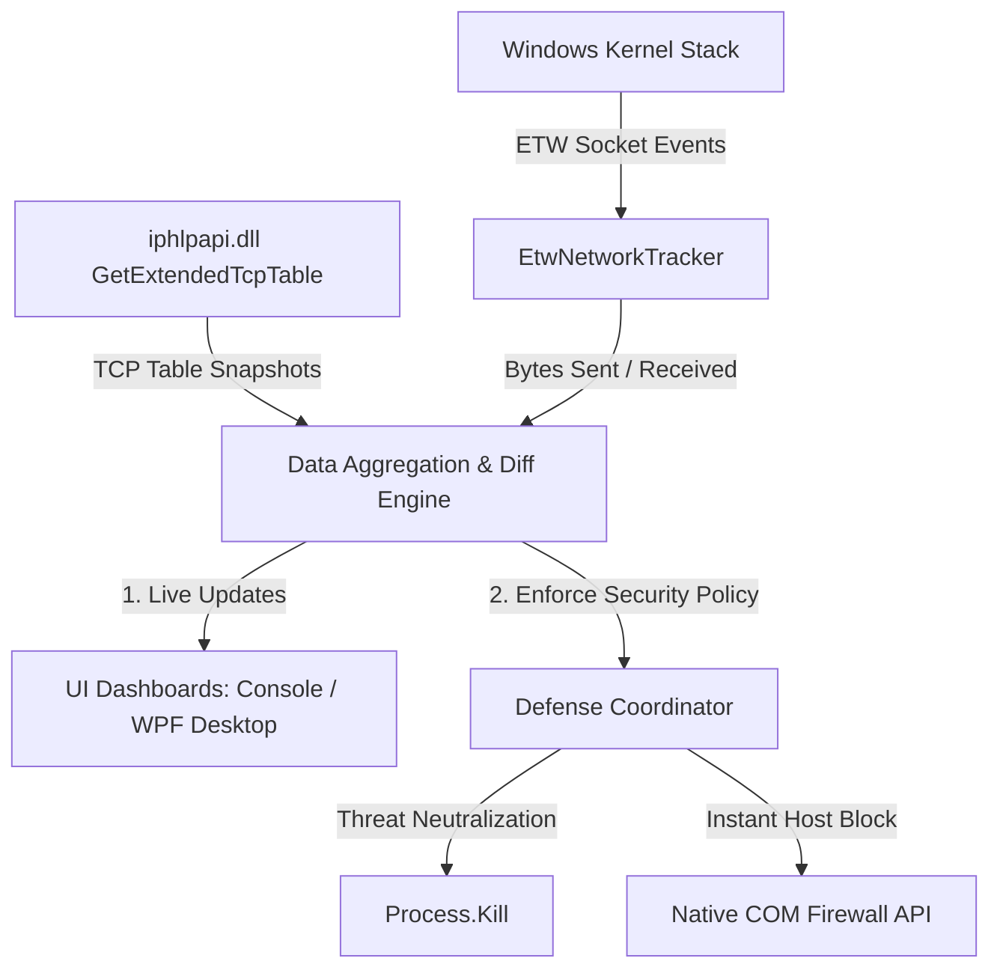

# 🛡️ Enterprise TCP Monitor (MyFirewall) v3.0

[](https://dotnet.microsoft.com/)
[](https://www.microsoft.com/windows)
[](https://dotnet.microsoft.com/download/dotnet/8.0)
[](LICENSE)

**Enterprise TCP Monitor** is an ultra-high performance, dual-interface network security and active host defense system built in C# for enterprise Windows environments. It intercepts outbound traffic at the kernel level using **Event Tracing for Windows (ETW)**, resolves geolocations and domain names asynchronously, and dynamically enforces active-blocking defense policies in under 1 millisecond using **direct in-process Windows Firewall COM API (HNetCfg)** interop.

The suite features both a responsive console dashboard for servers and a premium, GPU-accelerated WPF Desktop application for workstations.

---

## 🚀 Enterprise Architectural Design

1. **Direct In-Process Firewall Control (Sub-Millisecond Execution)**: 
   Replaces slow, heavy `powershell.exe` command spawns which flood Windows Event Log (Event ID 4104). By communicating directly with the `HNetCfg.FwPolicy2` COM object, firewall rule creation and removal happen instantaneously with zero CPU overhead.
   
2. **Kernel-Level ETW Network Sniffing**: 
   Taps directly into kernel socket providers (`TcpIpSend`/`TcpIpRecv`) to measure upload and download throughput per process ID in real-time, bypassing user-mode API limitations.
   
3. **Autopilot Defense & Threat Termination**: 
   Monitors connection behaviors and automatically terminates blacklisted process IDs while dynamically adding firewall rules to block new remote destination IPs contacted by those threats.
   
4. **Smart-Diff Zero-Flicker Grid**: 
   The WPF Desktop application utilizes an efficient in-memory hash diffing mechanism to update the UI connections grid. It preserves selections, scrolling, and column sorting, eliminating grid flicker entirely.
   
5. **Throttled GeoIP Queue & Resilient Backoff**: 
   Protects upstream rate limits with a serialized queue wrapper and exponential backoff retry mechanism.
   
6. **Graceful UAC Elevation Fallback**: 
   The console application elevates automatically, while the desktop app performs a silent elevation request on launch. If the user declines admin privilege, the desktop app falls back to a clean, read-only "No Admin" mode, informing the user instead of crashing or exiting.

---

## 📊 System Architecture & Process Flow



---

## 🎨 System Infographics


---

## ✨ Features & Capabilities

- 🛸 **GPU-Accelerated Desktop UI**: Dark theme utilizing glassmorphism styles, glowing status badges, active alert feeds, and responsive user interaction.
- ⚡ **Spectre.Console CLI**: Low-overhead terminal dashboard for server deployments with keyboard hotkeys.
- 🌍 **GeoIP & ISP Lookup**: Flags remote IP geolocations, organizations, and domain names instantly.
- ⚙️ **Manual Overrides**: Persisted configurations are safely updated and maintained without dynamic overwrites.
- 📁 **Centralized Diagnostics**: Complete logging of system events and exceptions in `crash.log`.

---

## ⌨️ Hotkeys & Control Map

| Key (Console) | WPF Action | Description |
|:---:|:---|:---|
| **`Q`** | **Close Window** | Gracefully shuts down active ETW kernel sessions, flushes buffers, and exits. |
| **`K`** | **Stop Process** | Terminate any active process selected from the list. |
| **`B`** | **Block IP** | Manually add/remove firewall outbound block rules for IPs. |
| **`I`** | **Hide App** | Ignore specific process names to clean up live dashboards. |
| **`L`** | **Toggle Lists** | Expand sidebar lists displaying all blocked IPs, hidden apps, and domain cache. |
| **`H / F1`** | **Help screen** | Displays active configuration directories, ETW states, and quick help. |

---

## 🛠️ Build & Run Instructions

- **OS**: Windows 10 / 11 or Windows Server (required for ETW and COM Firewall).
- **Framework**: .NET 8.0 SDK or later.

### Building from Source

```bash
# Clone the repository
git clone https://github.com/dparksports/myfirewall.git
cd myfirewall

# Build the solution in Release configuration
dotnet build --configuration Release
```

### Running the CLI Console Edition
Run PowerShell or Cmd as **Administrator**:
```bash
dotnet run --project MyFirewall.csproj
```

### Running the Desktop GUI Edition
Double-click the executable or run via CLI. It will prompt for UAC elevation automatically:
```bash
dotnet run --project MyFirewall.Desktop/MyFirewall.Desktop.csproj
```

---

## 📂 Configuration Storage

Files are stored in the application directory:
- **`blocked.txt`**: Active block rules (format: `IP|ProcessName`).
- **`ignored.txt`**: Hushed processes (one per line).
- **`crash.log`**: Diagnostics, exceptions, and event summaries.

---

## 🛡️ License

This project is licensed under the Apache License 2.0. See the [LICENSE](LICENSE) file for details.

***
made with a heart in california
