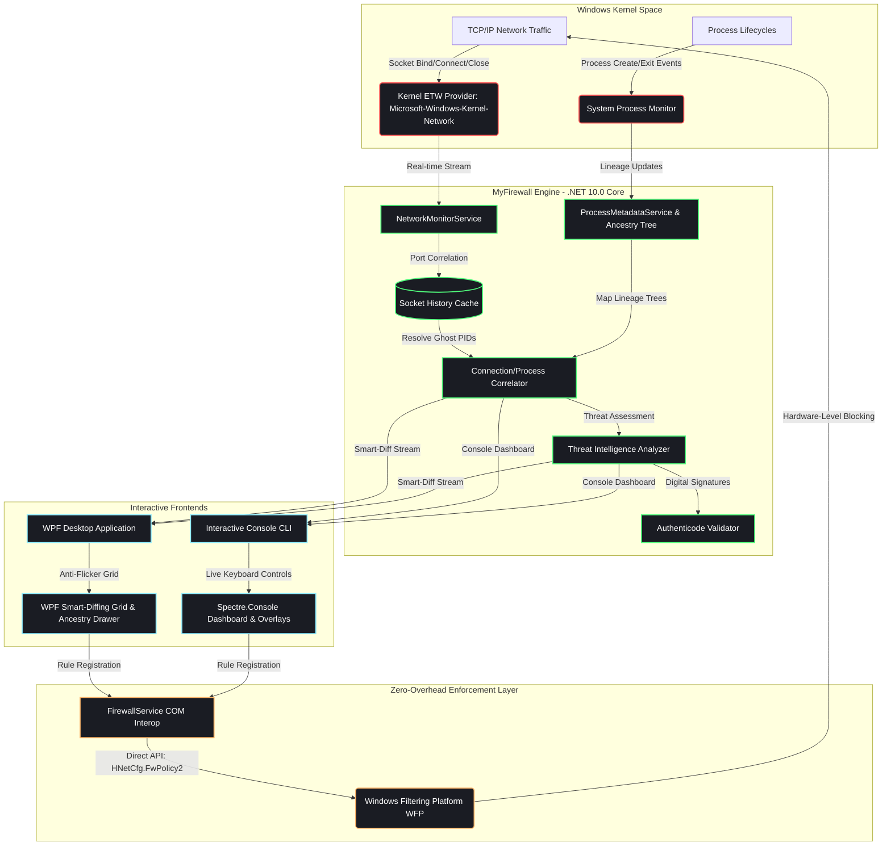

# 🛡️ MyFirewall: Advanced Kernel-Level TCP Monitor & WFP Firewall (.NET 10.0 Edition)

**MyFirewall** is a high-performance Windows network security platform that bridges real-time kernel telemetry with proactive, native Windows Filtering Platform (WFP) firewall enforcement. By capturing socket events at the kernel boundary, resolving parent process trees, and utilizing native in-process COM bindings, MyFirewall delivers zero-overhead security monitoring and instantaneous traffic blocking.

---

## 📊 System Architecture & Infographics

The following interactive infographic details the high-frequency telemetry pipeline and direct COM enforcement architecture:



---

## 🌟 Key Features

*   **⚡ Real-Time Kernel Telemetry**: Anchored directly onto `Microsoft-Windows-Kernel-Network` Event Tracing for Windows (ETW), monitoring millions of connection events without kernel-mode driver overhead.
*   **🔌 Direct COM WFP Integration**: Bypasses slow shell invocations (like `netsh.exe` or PowerShell scripts) by interacting directly with the native Windows Filtering Platform via in-process COM bindings (`HNetCfg.FwPolicy2`).
*   **🌳 Deep Process Ancestry Mapping**: Dynamically tracks and reconstructs full parent-child execution chains (e.g., `explorer.exe` ↳ `cmd.exe` ↳ `powershell.exe` ↳ `curl.exe`), preserving historical paths even when intermediate parent processes have exited.
*   **👻 Socket Back-Tracing (PID 0 Ghosting Fix)**: Windows often maps closed sockets to `PID 0` (Idle) or `Unknown`. MyFirewall uses an in-memory active socket history cache to accurately attribute transient connections back to their true initiating applications.
*   **🔍 Threat Intelligence Analyzer**: Performs digital signature validation (Authenticode), execution-path scanning, and structural parent-child relationship validation to flag suspicious or unsigned processes immediately.
*   **🖥️ WPF Desktop Dashboard**: Responsive desktop GUI with smart grid diffing (only updates rows that changed, preventing UI thread freezing) and a slide-out Process Lineage details drawer.
*   **⌨️ Live Keyboard CLI**: High-frequency terminal interface using `Spectre.Console`, enabling interactive process tree termination, blocking filters, and instant rules management in a streamlined console.

---

## 🏗️ Technical Pipeline & Lifecycle

1.  **Ingestion**: An ETW session is opened, registering for socket creation, connection, and termination events.
2.  **Correlative Linking**: Socket ports and addresses are cross-referenced with active process tables and a historical socket cache to identify the owning process name and path.
3.  **Lineage Resolution**: The process ID is mapped against a dynamically constructed system-wide process spawning tree to fetch its ancestors.
4.  **Metadata Enrichment**: Digital signatures are verified, and executable details are analyzed for security status.
5.  **Enforcement**: On block requests, WFP's Firewall Policy COM interface is directly invoked, registering blocking rules instantaneously at the Windows firewall level.

---

## 📥 Verification & Installation

Releases are packaged as self-contained Windows executables:

| Package | Execution Mode | Target Platform |
| :--- | :--- | :--- |
| `release_cli_win_x64.zip` | Keyboard-driven terminal client | Windows x64 (No .NET Runtime required) |
| `release_desktop_win_x64.zip` | WPF Graphical user interface | Windows x64 (No .NET Runtime required) |

### Integrity Verification

To verify that your downloaded package has not been tampered with, run the following command in PowerShell to compute and check the SHA-256 checksum:

```powershell
Get-FileHash .\release_desktop_win_x64.zip -Algorithm SHA256
```

---

## 📖 Operational Guide

> [!WARNING]
> Because MyFirewall interacts directly with OS kernel telemetry (ETW) and native firewall interfaces (WFP), both the CLI and Desktop clients must be run with **Administrator privileges (UAC elevated)**.

### WPF Graphical Console
1. Launch `MyFirewall.Desktop.exe` as Administrator.
2. Monitor real-time TCP connection streams with precise details on PID, executable path, destination IP, and geographical origin.
3. Click any connection row to slide open the **Process Ancestry Drawer** depicting the spawning history of the application.
4. Right-click any row to manage rule enforcement:
    *   **Block Remote IP**: Adds a native WFP block rule for the destination IP address.
    *   **Ignore Process**: Hides the process connections from active UI grids.
    *   **Kill Process Tree**: Terminates the process along with all of its child processes recursively.

### Interactive Command Line (CLI)
Launch `MyFirewall.exe` as Administrator. Control the real-time panel with key controls:

*   `Q` - Safely detach ETW tracing sessions and close the application.
*   `K` - Interactively terminate any process by PID or Name.
*   `B` - Toggle the management dashboard for currently blocked IP addresses.
*   `I` - Toggle the interactive process ignore/filter rules.
*   `P` - View authenticodes, signatures, and threat intelligence metadata for running apps.
*   `L` - Show/hide active filters and blocks at the bottom of the live telemetry panel.
*   `H` - Toggle the keyboard layout instructions modal.

---

## ⚙️ Compilation & Build

To compile MyFirewall from source, you must install the **.NET 10.0 SDK**.

### Compiling the CLI Application
To publish a completely self-contained, high-performance single-file CLI executable:
```powershell
dotnet publish MyFirewall.csproj -c Release -r win-x64 --self-contained true -p:PublishSingleFile=true -p:PublishReadyToRun=true -o ./publish/cli
```

### Compiling the WPF Desktop Application
To publish a completely self-contained, high-performance desktop executable:
```powershell
dotnet publish MyFirewall.Desktop/MyFirewall.Desktop.csproj -c Release -r win-x64 --self-contained true -p:PublishSingleFile=true -p:PublishReadyToRun=true -o ./publish/desktop
```

---

## 📄 License

This project is licensed under the Apache License 2.0. See the [LICENSE](LICENSE) file for details.
