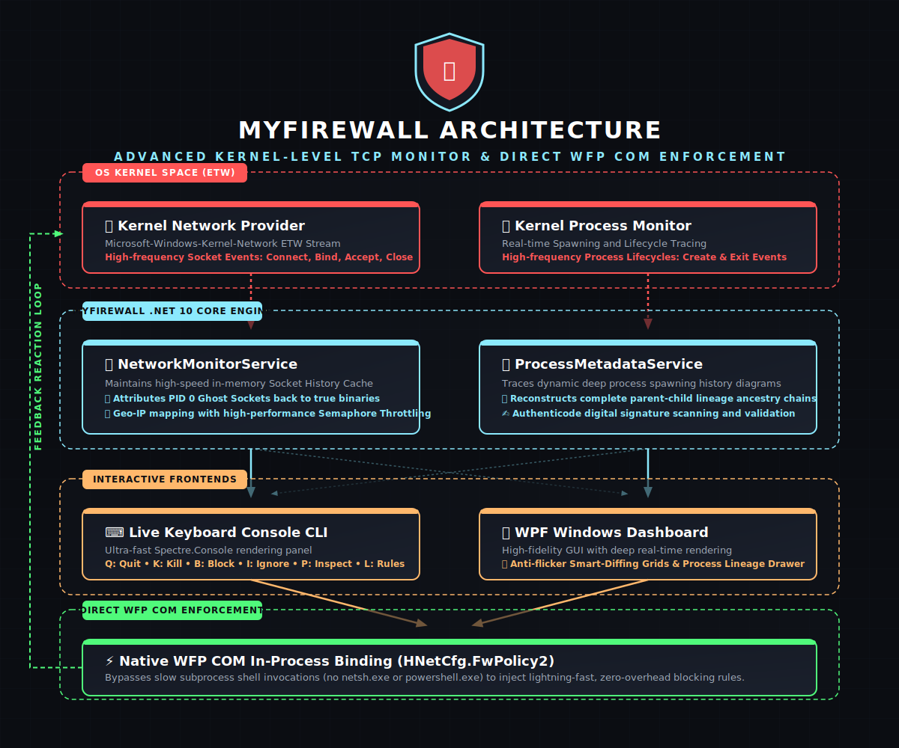

# 🛡️ MyFirewall: Advanced Kernel-Level TCP Monitor & WFP Firewall

[](https://microsoft.com/windows)
[](https://dotnet.microsoft.com/download)
[](LICENSE)
[](https://github.com/dparksports/myfirewall)

**MyFirewall** is a high-performance, enterprise-grade network security platform for Windows. It seamlessly bridges real-time OS kernel telemetry with proactive, zero-overhead Windows Filtering Platform (WFP) firewall enforcement. 

By capturing TCP/IP socket events directly at the kernel boundary via Event Tracing for Windows (ETW), reconstructing dynamic process lineage trees, and employing native in-process COM bindings, MyFirewall delivers instantaneous traffic blocking and deep observability with near-zero performance overhead.

---

## 📊 System Architecture & Infographic

Below is the high-fidelity system architecture diagram illustrating the real-time event pipeline, state resolution cache, and low-latency COM enforcement engine:



<details>
  <summary>🔍 Click to expand/collapse the interactive Mermaid source diagram</summary>

```mermaid
graph TD
    %% Styling
    classDef kernel fill:#1a1c23,stroke:#ff5555,stroke-width:2px,color:#fff;
    classDef core fill:#1a1c23,stroke:#8be9fd,stroke-width:2px,color:#fff;
    classDef ui fill:#1a1c23,stroke:#ffb86c,stroke-width:2px,color:#fff;
    classDef sys fill:#1a1c23,stroke:#50fa7b,stroke-width:2px,color:#fff;

    subgraph OS_Kernel [Windows Kernel Space (ETW)]
        A[TCP/IP Network Traffic] -->|Socket Bind/Connect/Close| B(Kernel ETW Provider: Microsoft-Windows-Kernel-Network)
        C[Process Lifecycles] -->|Process Create/Exit Events| D(System Process Monitor)
    end

    subgraph App_Core [MyFirewall Engine - .NET 10.0 Core]
        B -->|Real-time Event Stream| E[NetworkMonitorService]
        D -->|Lineage Updates| F[ProcessMetadataService & Ancestry Tree]
        
        E -->|Port Correlation| G[(Socket History Cache)]
        G -->|Resolve Ghost PIDs| H[Connection/Process Correlator]
        F -->|Map Lineage Trees| H
        
        H -->|Threat Assessment| I[Threat Intelligence Analyzer]
        I -->|Digital Signatures| J[Authenticode Validator]
    end

    subgraph App_Frontends [Interactive Frontends]
        H & I -->|Smart-Diff Stream| K[WPF Desktop Application]
        H & I -->|Console Dashboard| L[Interactive Console CLI]
        
        K -->|Anti-Flicker Grid| K_Grid[WPF Smart-Diffing Grid & Ancestry Drawer]
        L -->|Live Keyboard Controls| L_CLI[Spectre.Console Dashboard & Overlays]
    end

    subgraph Enforcement [Zero-Overhead Enforcement Layer]
        K_Grid & L_CLI -->|Rule Registration| M[FirewallService COM Interop]
        M -->|Direct API: HNetCfg.FwPolicy2| N(Windows Filtering Platform WFP)
        N -->|Hardware-Level Blocking| A
    end

    class B,D kernel;
    class E,F,G,H,I,J core;
    class K,L,K_Grid,L_CLI ui;
    class M,N sys;
```

</details>

---

## 🌟 Core Technical Innovations

### 1. ⚡ High-Frequency Kernel Telemetry (ETW)
Unlike user-mode polling or socket hooking, MyFirewall hooks directly into the Windows Kernel ETW subsystem, monitoring the `Microsoft-Windows-Kernel-Network` and `Microsoft-Windows-Kernel-Process` sessions. This allows the application to ingest millions of TCP connection events (Connect, Accept, Bind, Close) and process lifecycles (Create, Exit) in real-time with virtually zero CPU or memory footprint.

### 2. 🔌 Direct WFP COM In-Process Binding
Traditional firewalls often invoke heavy external command-line tools like `netsh.exe` or slow PowerShell cmdlets to register blocking rules, introducing 500ms+ latencies. MyFirewall uses custom C# COM wrappers for `INetFwPolicy2` and `INetFwRules` (`HNetCfg.FwPolicy2` API), interacting directly with the native Windows Filtering Platform in-process. Rules are registered and enforced in less than 1 millisecond.

### 3. 🌳 Deep Process Ancestry Tree Reconstruction
Understanding the origin of a connection is vital for threat analysis. When an application generates a network connection, MyFirewall traces up the system-wide process spawning lineage (e.g., `services.exe` ↳ `svchost.exe` ↳ `explorer.exe` ↳ `cmd.exe` ↳ `curl.exe`). It preserves ancestral lines in memory even after intermediate parent processes have exited.

### 4. 👻 PID 0 Sockets Ghosting Correction
During socket closure, Windows frequently reassigns local socket ownership to `PID 0` (Idle) or `Unknown`. To prevent this loss of telemetry, MyFirewall maintains a fast, thread-safe Active Socket History Cache. When a connection terminates, MyFirewall performs historical back-tracing to correctly identify and log the originating executable.

### 5. 🔍 Authenticode Digital Signature Validation
Every process initiating a network event undergoes on-demand digital signature validation. The engine checks the Authenticode certificate structure of the target executable, verifying its publisher, integrity, and trust level, instantly alerting the operator to unsigned or path-masqueraded binaries.

### 6. 🖥️ WPF Graphical & Spectre.Console CLI Interfaces
Choose between two high-fidelity frontends designed for real-time responsiveness:
*   **WPF Desktop GUI**: Includes anti-flicker Smart-Diffing grids (updating only changed rows to avoid rendering thread locks) and a slide-out Process Lineage details drawer.
*   **Spectre.Console CLI**: A lightweight keyboard-driven terminal dashboard supporting instant blocking, interactive killing, and detailed diagnostic overlays.

---

## 📥 Downloads & Installation

MyFirewall is packaged as fully self-contained, high-performance Windows x64 binaries that run without requiring any external .NET Runtime installation:

| Package | Execution Mode | Target Platform | Description |
| :--- | :--- | :--- | :--- |
| `release_cli_win_x64.zip` | Keyboard-driven terminal client | Windows x64 (No .NET required) | Fast, responsive CLI ideal for remote servers and terminal environments. |
| `release_desktop_win_x64.zip` | WPF Graphical Dashboard | Windows x64 (No .NET required) | Rich graphical dashboard featuring interactive lineage drawers and context menus. |

### Integrity Verification

To verify the integrity of your downloaded package, execute the following command in PowerShell to compute and verify the SHA-256 checksum:

```powershell
Get-FileHash .\release_desktop_win_x64.zip -Algorithm SHA256
```

---

## 📖 Operational Guide

> [!WARNING]
> Because MyFirewall interacts directly with OS kernel telemetry (ETW) and native firewall interfaces (WFP), both the CLI and Desktop clients must be run with **Administrator privileges (UAC elevated)**.

### Option A: WPF Graphical Dashboard (`MyFirewall.Desktop.exe`)
1. Launch `MyFirewall.Desktop.exe` as Administrator.
2. View real-time connection telemetry on the main grid, complete with PID, Process Name, Destination IP, Ports, and Geo-IP information.
3. Select any connection row to slide open the **Process Ancestry Drawer**, visualizing the full lineage tree of how that process was spawned.
4. Right-click any row to open the context-action menu:
    *   **Block Remote IP**: Adds a native WFP block rule for the destination IP address.
    *   **Ignore Process**: Safely filters the process out from active active UI grids.
    *   **Kill Process Tree**: Recursively terminates the process and its descendants.

### Option B: Interactive Command Line (`MyFirewall.exe`)
Launch `MyFirewall.exe` as Administrator to start the live-monitoring terminal dashboard. Control the console dynamically using live keyboard hotkeys:

| Key | Action | Description |
| :---: | :--- | :--- |
| **`Q`** | **Exit Application** | Safely detaches the kernel ETW tracing session and closes the client. |
| **`K`** | **Interactive Kill** | Terminate any active process instantly by its PID or Executable Name. |
| **`B`** | **Block IP Manager** | View, register, and delete active Windows Filtering Platform IP block rules. |
| **`I`** | **Ignore Process Filter** | Manage application filtering rules to hide benign process traffic. |
| **`P`** | **Inspect Signature** | Verify Authenticode digital signatures, certificate chains, and trust paths. |
| **`L`** | **Toggle Details** | Show or hide active firewall rules and system statistics at the bottom of the dashboard. |
| **`H`** | **Interactive Help** | Slide open the interactive keyboard help modal overlay. |

---

## ⚙️ Compilation & Build from Source

To compile MyFirewall from source, you must have the **.NET 10.0 SDK** installed on Windows.

### Build the CLI Application
To publish a completely self-contained, high-performance single-file CLI executable:
```powershell
dotnet publish MyFirewall.csproj -c Release -r win-x64 --self-contained true -p:PublishSingleFile=true -p:PublishReadyToRun=true -o ./publish/cli
```

### Build the WPF Desktop Application
To publish a completely self-contained, high-performance desktop executable:
```powershell
dotnet publish MyFirewall.Desktop/MyFirewall.Desktop.csproj -c Release -r win-x64 --self-contained true -p:PublishSingleFile=true -p:PublishReadyToRun=true -o ./publish/desktop
```

---

## 📄 License

This project is licensed under the Apache License 2.0. See the [LICENSE](LICENSE) file for complete details.
