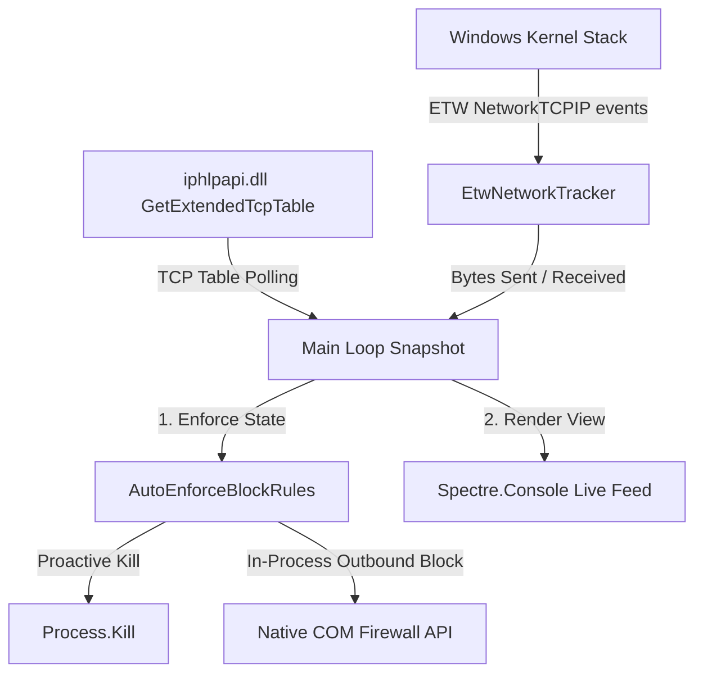
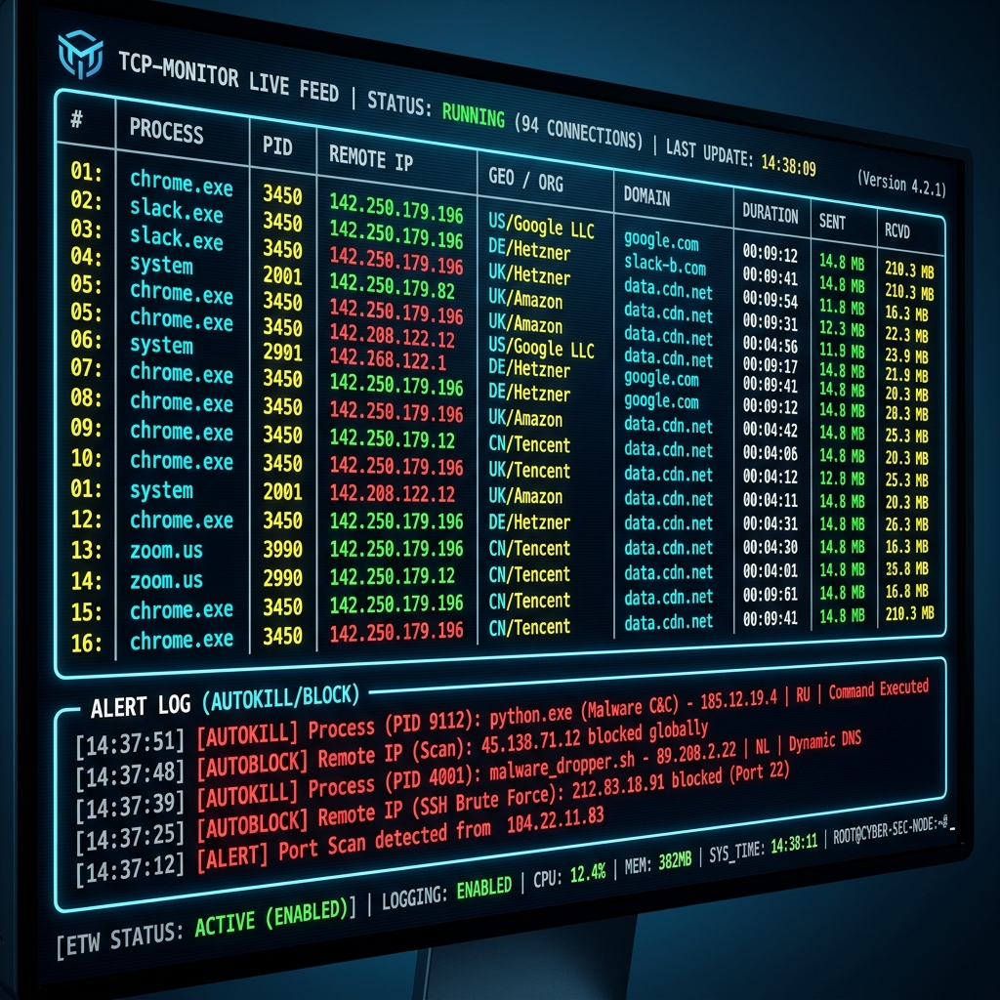

# 🔒 TCP Monitor (MyFirewall)

[](https://dotnet.microsoft.com/)
[](https://www.microsoft.com/windows)
[](https://dotnet.microsoft.com/download/dotnet/8.0)
[](LICENSE)

TCP Monitor is a high-performance, console-based network security tool built in C# for Windows. It taps directly into the Windows kernel using **Event Tracing for Windows (ETW)** to trace active TCP connections, resolve geolocations/domains with aggressive throttling, and proactively block malicious processes and remote IPs instantly and silently through the **native Windows Firewall COM API (HNetCfg)**.

---

## 🚀 Key Architectural Breakthroughs (v4.0)

In this version, the entire backend was refactored to eliminate overhead and fix critical performance bottlenecks:

1. **Native Firewall Integration (No PowerShell Spawning)**: Removed slow and heavy `powershell.exe -Command "New-NetFirewallRule ..."` spawning which flooded the Windows Event Log (Event ID 4104). It now communicates directly with `HNetCfg.FwPolicy2` COM object in-process, completing rule changes in under 1 millisecond.
2. **Auto-Kill Logic Fixed**: Resolved the inverted PID termination bug so blocked processes are terminated proactively and accurately exactly once, rather than spawning infinite polling processes.
3. **Smart Deduplication & Validation**: Every IP is validated before being processed, and duplicate Windows Firewall rules are prevented using strict in-memory hash check checks (`RuleExists`).
4. **ETW Network Sniffing**: Uses kernel-level tracers (`TcpIpSend`/`TcpIpRecv`) to accurately report bytes sent and received per process with near-zero performance overhead.
5. **Robust GeoIP Throttling & Backoff**: Standardized async queries with a `SemaphoreSlim(1,1)` serial queue to respect third-party rate limits, and implemented exponential backoff retries.

---

## 📊 System Architecture & Process Flow

The system operates via a decoupled, highly structured workflow:



---

## 🖥️ Live Terminal Interface

The program leverages a premium command-line dashboard powered by `Spectre.Console`:



---

## ✨ Features

- 🛰️ **Kernel-Level ETW Tracing**: Real-time measurement of total uploaded and downloaded traffic per process.
- 🌍 **GeoIP & Org Resolution**: Identifies the destination country and ISP/Organization for remote connection endpoints.
- 🛑 **Native Proactive Defense**:
  - Automatically terminates running instances of blocked processes.
  - Automatically registers outbound block rules for new remote IPs contacted by blocked processes.
- ⌨️ **Interactive UI Controls**: Quick action keys to block, ignore, kill, or review details on the fly.
- 📝 **Preserved Manual Configuration**: The ignore list file (`ignored.txt`) is no longer overwritten dynamically during loops; manual edits are fully respected and only updated when explicitly requested in-app or on graceful exit.
- 📂 **Centralized Logging**: Diagnostic warnings and COM exceptions are cleanly recorded in `crash.log`.

---

## ⚙️ Configuration Files

All data is persisted locally in simple, human-readable plain-text files:

- **`blocked.txt`**: List of blocked IP addresses and their associated process name (format: `IP|ProcessName`).
- **`ignored.txt`**: List of process names to ignore and filter out from the active feed (one name per line).
- **`crash.log`**: Errors, COM exceptions, or network diagnostic failures.

---

## 🎹 Keyboard Controls

| Key | Action | Description |
|:---:|:---|:---|
| **`Q`** | **Quit** | Gracefully disposes the ETW session, saves lists, and exits. |
| **`K`** | **Kill Process** | Interactively select and terminate any running TCP process. |
| **`B`** | **Block IP** | Interactively block or unblock specific remote IPs via Windows Firewall. |
| **`I`** | **Ignore Process** | Add or remove process names to filter out of the terminal feed. |
| **`L`** | **Toggle Lists** | Expand grid view showing all Blocked IPs, Ignored Processes, and Domain Cache. |
| **`H / F1`** | **Help Screen** | Review application status, controls, and configuration details. |

---

## 🛠️ Build & Run Requirements

- **Operating System**: Windows (required for ETW kernel sessions and Windows Firewall COM interop).
- **Permissions**: Must be run with **Administrator privileges** to register the kernel trace session and apply firewall rules.
- **Framework**: .NET 8.0 SDK or later.

### Quick Start

1. Open PowerShell or Command Prompt as **Administrator**.
2. Navigate to the project directory.
3. Build the application:
   ```bash
   dotnet build --configuration Release
   ```
4. Run the executable:
   ```bash
   dotnet run
   ```

---

## 🛡️ License

This project is licensed under the Apache License 2.0. See the [LICENSE](LICENSE) file for details.
