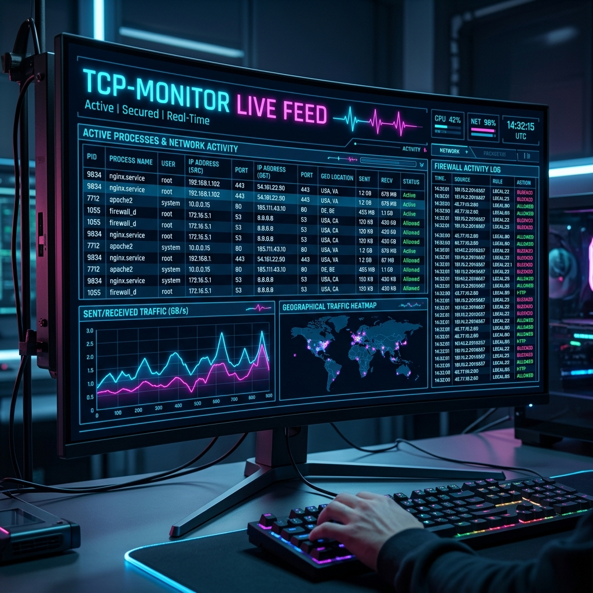

# TCP Monitor (MyFirewall)



TCP Monitor is a modern, console-based network security tool built with C# .NET. It leverages Event Tracing for Windows (ETW) to provide real-time tracking of active TCP connections, geographical IP resolution, and automated proactive blocking of malicious or unwanted processes and IPs via Windows Firewall rules.

## Features
- **Real-Time Traffic Monitoring**: Monitor TCP connection state, total bytes sent, and received per process using high-performance ETW.
- **Geo-IP & Domain Lookup**: Automatically resolves and displays the physical location, organization, and domain associated with remote IP addresses.
- **Auto-Enforcement & Alerts**: Proactively kills known malicious processes and blocks unknown IPs that attempt outbound connections using dynamic PowerShell firewall rules. The terminal alerts you whenever an action is automatically enforced.
- **Interactive UI**: A sleek terminal interface powered by `Spectre.Console` offering hotkeys to ignore processes, selectively block IPs, and visualize connection details.


## Installation & Requirements
- Windows OS (requires Event Tracing for Windows)
- Administrative privileges (required for ETW session creation and Windows Firewall rule modification)
- .NET 8.0 SDK or later

## Build and Run

1. Clone the repository.
2. Build the project:
   ```bash
   dotnet build
   ```
3. Run the project with **Administrator privileges**:
   ```bash
   dotnet run
   ```

## Controls
- `Q` - Quit the application
- `K` - Kill a selected process interactively
- `B` - Manage and block specific IPs interactively
- `I` - Ignore specific processes to reduce noise in the feed
- `L` - Toggle additional lists (Blocked IPs, Ignored Processes, Domain Cache)
- `H` / `F1` - Show Help

## Architecture
This project utilizes the `Microsoft.Diagnostics.Tracing.TraceEvent` library to tap directly into the Windows Kernel network stack, ensuring low-overhead packet tracking. The interface is rendered using `Spectre.Console` for cross-platform compatible ANSI terminal UI elements.
