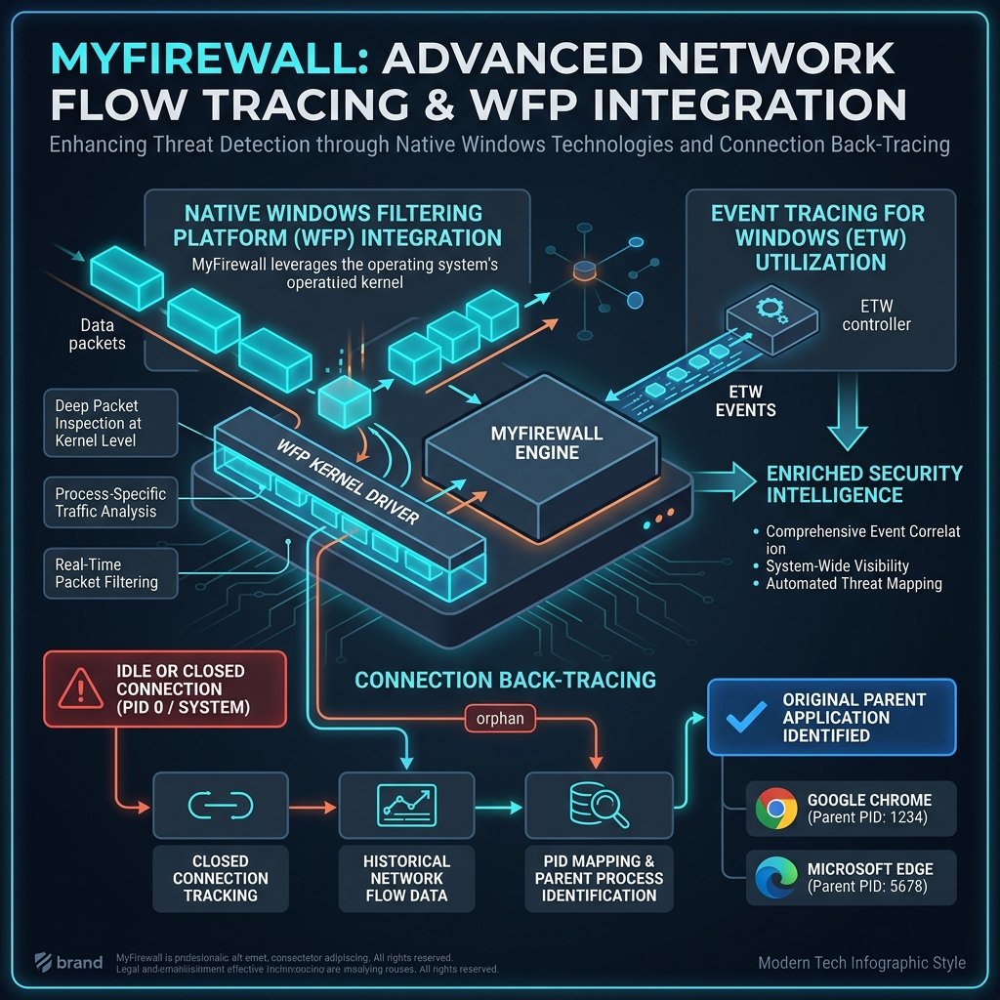

# 🛡️ MyFirewall: Advanced Kernel-Level TCP Monitor & WFP Firewall

**MyFirewall** is a premium, high-performance security utility for Windows that bridges the gap between low-level network telemetry and proactive firewall control. Combining Event Tracing for Windows (ETW) with direct Windows Filtering Platform (WFP) integration, MyFirewall delivers real-time visibility and instant enforcement capability through both a console-based CLI and a WPF Desktop interface.



## 🌟 Key Features

*   **Real-Time Kernel Telemetry:** Hooks directly into the Microsoft-Windows-Kernel-Network ETW provider for zero-overhead, real-time packet and socket connection monitoring.
*   **Direct WFP Integration:** Interacts with the native Windows Filtering Platform using direct COM interface bindings (`HNetCfg.FwPolicy2`). No slow shell commands, no `netsh.exe`, no PowerShell overhead.
*   **Connection Back-Tracing (PID 0 Ghosting Resolution):** Automatically tracks transient socket-level connections. When a process closes a connection, the OS often attributes the closing state to `PID 0` (Idle) or `Unknown`. MyFirewall caches active socket keys (`RemoteIP:RemotePort-LocalPort`) to back-trace and correctly identify the originating application (e.g., `chrome (closed)`), closing the visibility gap.
*   **Threat Intelligence Analyzer:** Inspects process metadata on the fly—including parent process ID, execution path, digital signatures, and authenticode validation.
*   **Geographic & DNS Resolution:** Asynchronously resolves remote IP locations and hostnames with built-in TTL caching to prevent system lag.
*   **Responsive WPF Desktop UI:** Features an anti-flicker smart-diffing data grid to seamlessly display hundreds of active connections in real-time.
*   **Interactive Command Line Interface:** A keyboard-driven console utility providing quick diagnostics, real-time logging, and interactive rule management.
*   **Process Tree Termination:** Instantly terminates suspicious applications along with their entire process ancestry.

---

## 🏗️ Architecture

```
                       [ Network Activity ]
                                │
                                ▼
                     [ Windows Kernel (ETW) ]
                                │
                                ▼
                   [ NetworkMonitorService ] 
                    (Socket History Cache)
                                │
          ┌─────────────────────┴─────────────────────┐
          ▼                                           ▼
   [ WPF Desktop UI ]                           [ Console CLI ]
(Smart Diff Connection Grid)                 (Interactive Rich UI)
          │                                           │
          └─────────────────────┬─────────────────────┘
                                │
                                ▼
                    [ FirewallManager COM ]
                                │
                                ▼
                  [ Windows Filtering Platform ]
```

1. **Kernel Hooking:** Captures socket connections immediately as they occur at the kernel layer.
2. **State Sync & Cache:** Maps remote IP/ports dynamically and maintains short-lived maps to resolve process IDs even after processes terminate.
3. **Native Filtering:** Manages native WFP rules directly, allowing rule evaluation to happen entirely in kernel space.

---

## 📥 Verification & Installation

Download the latest release package matching your environment:

| Artifact | Platform | Description |
| :--- | :--- | :--- |
| `release_cli_win_x64.zip` | Windows (x64) | Standalone console executable. |
| `release_desktop_win_x64.zip` | Windows (x64) | WPF Graphical application. |

### Verify Artifact Integrity
To verify the integrity of the downloaded zip files, use PowerShell to validate the SHA256 checksum:

```powershell
Get-FileHash .\release_desktop_win_x64.zip -Algorithm SHA256
```

---

## 📖 Usage Guide

Both applications require administrative privileges (UAC elevation) to register ETW tracing sessions and modify WFP firewall rules.

### WPF Desktop Application
1. Run `MyFirewall.Desktop.exe` as Administrator.
2. The main window lists active TCP connections with their PID, Domain, Geo-IP, and process information.
3. **Right-click** any connection row to open the context menu:
    *   **Block Remote IP:** Immediately block all traffic to/from that remote IP.
    *   **Ignore Process:** Filter out the selected application from the UI list.
    *   **Kill Process Tree:** Terminate the parent process and all its children.
4. Toggle the **Threat Intelligence** strategies in the top bar to adjust active auditing depth.

### CLI Console Application
Run `MyFirewall.exe` as Administrator. Manage the monitor in real-time using the following interactive keys:

*   `Q` - Quit the application cleanly and tear down the ETW session.
*   `K` - Interactively kill an active process by PID or Name.
*   `B` - Manage and view blocked IPs.
*   `I` - Manage and view ignored processes.
*   `P` - View deep process intelligence (execution path, signature status).
*   `T` - Toggle the active threat intelligence strategy.
*   `L` - Toggle display of rules list (active blocks/ignores) at the bottom.
*   `H` - Show the interactive help overlay.

---

## 📄 License

This project is licensed under the Apache License 2.0. See the [LICENSE](LICENSE) file for details.
