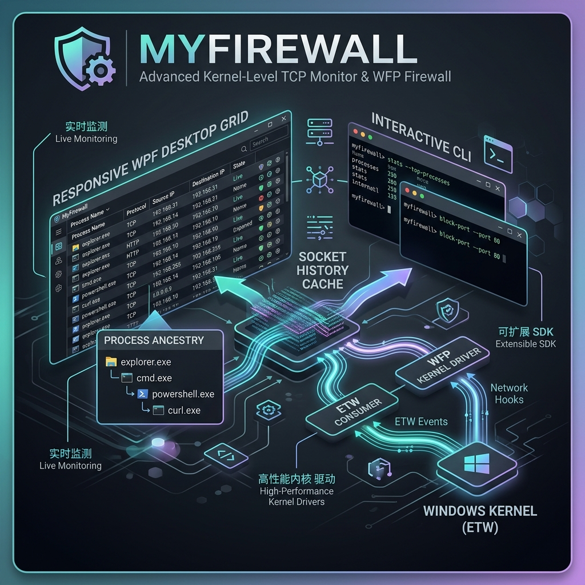

# 🛡️ MyFirewall: Advanced Kernel-Level TCP Monitor & WFP Firewall

**MyFirewall** is a high-performance Windows network security tool that bridges low-level kernel event tracing with proactive, native Windows Filtering Platform (WFP) firewall rules. By monitoring connection events in real-time at the kernel layer, MyFirewall tracks the lifecycle of every network socket, resolves parent process execution chains, and provides instant, zero-overhead enforcement capabilities through both a keyboard-driven CLI and an anti-flicker WPF Desktop interface.



---

## 🌟 Key Features

*   **Real-Time Kernel Telemetry**: Built directly on top of the `Microsoft-Windows-Kernel-Network` Event Tracing for Windows (ETW) provider for high-throughput, low-overhead packet and socket event monitoring.
*   **Direct COM WFP Integration**: Interacts directly with native Windows Filtering Platform APIs via in-process COM bindings (`HNetCfg.FwPolicy2`). No `netsh.exe` shell execution, no PowerShell scripting overhead, and zero user-visible command windows.
*   **Deep Process Ancestry Resolution**: Automatically tracks and builds the execution chain of network sockets (e.g., `explorer.exe` ↳ `cmd.exe` ↳ `powershell.exe` ↳ `curl.exe`). By hooking process lifecycle events, MyFirewall maps and keeps track of lineage even if intermediate parents have terminated.
*   **Socket Back-Tracing & PID 0 Ghosting Resolution**: Tracks transient network sockets. When a socket closes, the OS often maps the closing state to `PID 0` (Idle) or `Unknown`. MyFirewall caches active socket keys (`RemoteIP:RemotePort-LocalPort`) to correctly attribute closing events to their originating process.
*   **Threat Intelligence Analyzer**: Analyzes process execution paths, parent-child relationships, and authenticode digital signatures to evaluate real-time threat levels.
*   **WPF Desktop GUI**: A clean graphical desktop console with an optimized smart-diffing data grid to render hundreds of concurrent connections smoothly, accompanied by a dynamic process lineage drawer.
*   **Interactive CLI**: A keyboard-driven shell console featuring instant rule configuration, logging, filters, and a real-time command terminal overlay.

---

## 🏗️ System Architecture

```
                    [ Network Connection Events ]
                                  │
                                  ▼
                   [ Windows Kernel (ETW Provider) ]
                                  │
                                  ▼
                    [ NetworkMonitorService.cs ]
                       (Socket History Cache)
                                  │
         ┌────────────────────────┴────────────────────────┐
         ▼                                                 ▼
  [ WPF Desktop UI ]                                [ Console CLI ]
(Smart Diffing Grid)                            (Interactive Rich UI)
         │                                                 │
         └────────────────────────┬────────────────────────┘
                                  │
                                  ▼
                        [ FirewallService COM ]
                                  │
                                  ▼
                     [ Windows Filtering Platform ]
```

1. **Kernel Hooking**: Registers an ETW session for network provider events.
2. **Lineage Resolution**: Captures process creation and termination events to maintain an in-memory process tree.
3. **Smart History Cache**: Correlates socket port mappings to capture the correct PID even for transient sockets.
4. **WFP COM Rule Registration**: Acquires the local firewall policy using native COM calls to add/remove block rules instantly.

---

## 📥 Verification & Installation

Download the latest binaries matching your platform from the releases:

| Package | Environment | Execution Mode |
| :--- | :--- | :--- |
| `release_cli_win_x64.zip` | Windows (x64) | Command-line interface with keyboard controls |
| `release_desktop_win_x64.zip` | Windows (x64) | WPF Desktop application with graphical dashboard |

### Verify File Integrity

To verify the integrity of the downloaded packages, check the SHA-256 hash using PowerShell:

```powershell
Get-FileHash .\release_desktop_win_x64.zip -Algorithm SHA256
```

---

## 📖 Usage Guide

> [!WARNING]
> Both the CLI and Desktop clients require administrative privileges (UAC elevation) to access the Windows kernel event system (ETW) and to modify firewall rules via COM.

### WPF Desktop Application
1. Run `MyFirewall.Desktop.exe` as Administrator.
2. View active connections grouped by process, execution path, location, and PID.
3. Select any connection to reveal the **Process Ancestry Drawer** on the right side.
4. Right-click any connection row to access the management action menu:
   - **Block Remote IP**: Immediately register a WFP rule blocking all outbound connections to that IP.
   - **Ignore Process**: Exclude the application from connection grids.
   - **Kill Process Tree**: Terminate the selected process and all its child processes.

### CLI Application
Run `MyFirewall.exe` as Administrator. Manage the dashboard using these interactive keys:

*   `Q` - Safely stop the ETW sessions and exit the program.
*   `K` - Interactively terminate a process by PID or Name.
*   `B` - View and manage the list of blocked remote IPs.
*   `I` - View and manage ignored process filters.
*   `P` - Review detailed security metadata and signature information of running processes.
*   `L` - Toggle the display of active blocks and filters at the bottom of the dashboard.
*   `H` - Show the keyboard shortcuts overlay.

---

## ⚙️ Compilation & Build

Building the project requires the **.NET 8.0 SDK** (or later).

### Command Line Interface (CLI)
To publish the CLI application as a self-contained single-file executable:
```powershell
dotnet publish MyFirewall.csproj -c Release -r win-x64 --self-contained true -p:PublishSingleFile=true -p:PublishReadyToRun=true -o ./publish/cli
```

### Desktop Application (WPF)
To publish the Desktop application as a self-contained package:
```powershell
dotnet publish MyFirewall.Desktop/MyFirewall.Desktop.csproj -c Release -r win-x64 --self-contained true -p:PublishSingleFile=true -p:PublishReadyToRun=true -o ./publish/desktop
```

---

## 📄 License

This project is licensed under the Apache License 2.0. See the [LICENSE](LICENSE) file for details.
