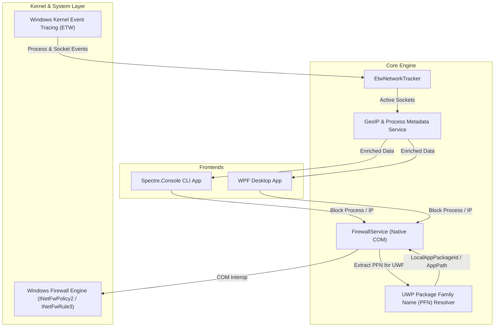

# 🛡️ MyFirewall

> **Ultra-Low Latency Windows Network Isolation & Process Security Suite**  
> Powered by **.NET 10.0**, Native Windows Firewall COM (`INetFwPolicy2`), Real-Time Kernel Event Tracing (ETW), **Spectre.Console CLI**, and a Dark-Theme **WPF Desktop Dashboard**.

---


---

## 🚀 Overview

**MyFirewall** is a lightweight, high-performance network monitor and process security suite for Windows. Designed for system administrators, security engineers, and power users, MyFirewall combines real-time kernel-level process interception with direct COM-level firewall rule management—providing zero-escape network enforcement without external dependencies or heavy background overhead.

---

## ✨ Core Capabilities

### ⚡ Real-Time Kernel Event Tracing (ETW)
* **Instant Process Interception**: Captures kernel `ProcessStart` and network events via `Microsoft.Diagnostics.Tracing.TraceEvent`.
* **Zero-Escape Enforcement**: Applies firewall rules the millisecond a target executable spawns—preventing network packets from leaving the adapter.
* **UWP & AppContainer Support**: Automatically resolves Package Family Names (PFN) for modern Windows Apps (e.g., `StartMenuExperienceHost`) to apply native `LocalAppPackageId` firewall isolation.
* **Ghost Connection Tracking**: Automatically highlights decaying sockets during Windows TCP teardown with visual opacity hints.

### 🧱 Native COM Windows Firewall Engine
* **Direct COM Interop**: Interacts directly with `HNetCfg.FwPolicy2` and `HNetCfg.FWRule` COM objects without relying on slow `powershell.exe` child processes.
* **Granular Process Isolation**: Severs specific network endpoints or blocks entire application executables natively.
* **System Component Shields**: Quick toggles to isolate or block system telemetry services like `msedgewebview2.exe` and UWP system hosts.

### 🖥️ Dual Modern User Interfaces

#### 1. Spectre.Console Terminal UI
* **Interactive CLI Dashboard**: Live TCP connection tables, color-coded ETW status indicators, thread-safe alert logs, and instant keyboard shortcuts.
* **Quick Keybindings**:
  * `Q` — Gracefully stop & exit
  * `K` — Interactively kill process trees
  * `B` — Manage blocked IP rules
  * `I` — Manage ignored application lists
  * `P` — Inspect process ancestry & digital signatures
  * `S` — System settings & telemetry toggles
  * `T` — Toggle threat monitoring strategy
  * `L` — Toggle viewable data tables
  * `R` — Reset & restore default firewall rules
  * `H / F1` — Interactive help modal

#### 2. WPF Dark-Mode Desktop App
* **Visual Control Center**: Modern dark dashboard with search & filtering across active connections.
* **Process Intelligence**: Deep inspection including digital certificates, executable path resolution, parent process trees, and dynamic bandwidth metrics.
* **One-Click Toggles**: Quick controls for system host isolation, telemetry shielding, and IP block lists.

---

## 🏗️ System Architecture


```mermaid
graph TD
    subgraph Kernel & System Layer
        Kernel["Windows Kernel Event Tracing (ETW)"]
        WinFW["Windows Firewall Engine (INetFwPolicy2 / INetFwRule3)"]
    end

    subgraph Core Engine
        ETW["EtwNetworkTracker"]
        Resolver["UWP Package Family Name (PFN) Resolver"]
        GeoService["GeoIP & Process Metadata Service"]
        FwService["FirewallService (Native COM)"]
    end

    subgraph Frontends
        CLI["Spectre.Console CLI App"]
        WPF["WPF Desktop App"]
    end

    Kernel -->|Process & Socket Events| ETW
    ETW -->|Active Sockets| GeoService
    GeoService -->|Enriched Data| CLI
    GeoService -->|Enriched Data| WPF
    
    CLI -->|Block Process / IP| FwService
    WPF -->|Block Process / IP| FwService
    
    FwService -->|Extract PFN for UWP| Resolver
    Resolver -->|LocalAppPackageId / AppPath| FwService
    FwService -->|COM Interop| WinFW
```

---

## 🛠️ Build & Installation

### Requirements
* **Windows 10 / 11** (64-bit)
* **.NET 10.0 SDK**
* **Administrator Privileges** (Required for ETW kernel session creation and Windows Firewall COM management)

### Build Commands

```powershell
# Clone the repository
git clone https://github.com/dparksports/myfirewall.git
cd myfirewall

# Build the CLI application
dotnet build MyFirewall.csproj -c Release

# Build the WPF Desktop application
dotnet build MyFirewall.Desktop/MyFirewall.Desktop.csproj -c Release

# Publish self-contained single-file binaries
dotnet publish MyFirewall.csproj -c Release -r win-x64 --self-contained -o ./publish/cli
dotnet publish MyFirewall.Desktop/MyFirewall.Desktop.csproj -c Release -r win-x64 --self-contained -o ./publish/desktop
```

---

## 📦 Automated Release

To automatically bump the version, build self-contained binaries, zip artifacts, commit changes, tag, and publish a GitHub release:

```powershell
.\release.ps1 -BumpType Patch
```

---

## 📜 License

This project is open source under the [MIT License](LICENSE).
