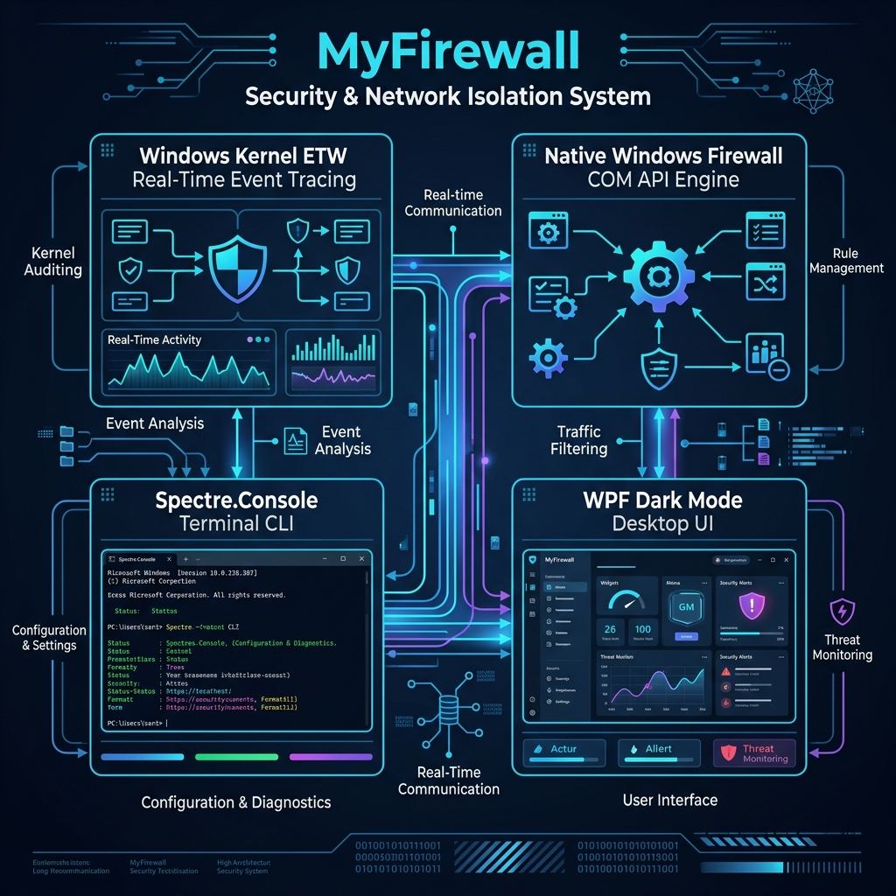
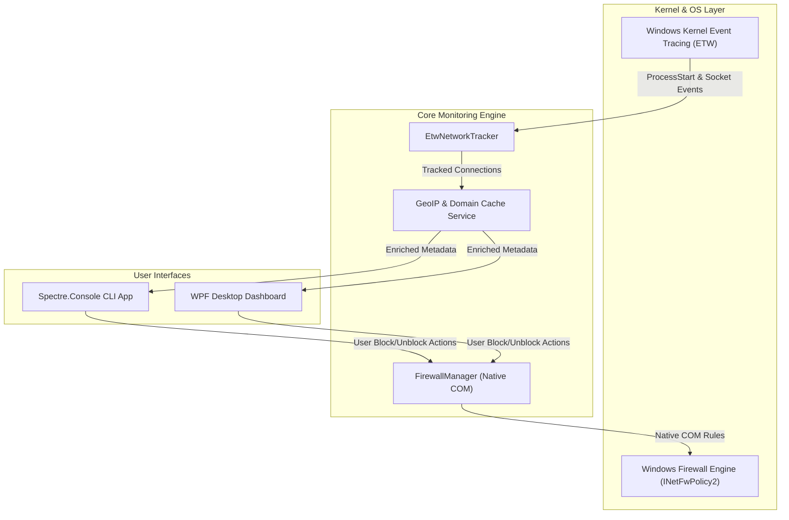

# 🛡️ MyFirewall v5.7.23

> **Ultra-Low Latency Windows Network Isolation & Process Security Suite**  
> Built with **.NET 10.0**, Native Windows Firewall COM (`INetFwPolicy2`), Real-Time Kernel Event Tracing (ETW), **Spectre.Console CLI**, and a Dark-Theme **WPF Desktop App**.

---



---

## 🌟 Key Features

### ⚡ Real-Time Kernel Event Tracing (ETW)
* **Instant Process Interception**: Listens directly to Windows Kernel `ProcessStart` and network events via `Microsoft.Diagnostics.Tracing.TraceEvent`.
* **Zero-Escape Enforcement**: Applies application-level firewall rules the millisecond a monitored executable spawns—before out-of-process network packets can leave the host adapter.
* **Ghost Connection Tracking**: Automatically detects and marks closed sockets in WPF with soft opacity until Windows TCP state teardown completes.

### 🧱 Native COM Windows Firewall Engine
* **Direct COM Interop**: Interacts natively with `HNetCfg.FwPolicy2` and `HNetCfg.FWRule` without relying on slow external `powershell.exe` subprocesses.
* **Decoupled Network Isolation**: Severs restricted IP endpoints while preserving shared process integrity (preventing infinite spawn-kill loops for components like Microsoft Edge WebView2).
* **Proactive WebView2 Network Shielding**: One-click toggle to isolate `msedgewebview2.exe` network access dynamically across registered installation paths.

### 🖥️ Dual User Interfaces (CLI & Desktop)
* **Spectre.Console Terminal UI**: Rich terminal dashboard featuring live connection tables, color-coded ETW status indicators, thread-safe alert logs, and quick interactive keybindings (`Q`, `K`, `B`, `I`, `P`, `S`, `T`, `L`, `R`).
* **WPF Dark-Mode Desktop App**: Premium WPF dashboard with status color brushes, real-time search/filtering, process ancestry graphs, digital signature verification, and system toggle controls.

---

## 🏗️ Architecture & Data Flow


```mermaid
graph TD
    subgraph Kernel & OS Layer
        Kernel["Windows Kernel Event Tracing (ETW)"]
        WinFW["Windows Firewall Engine (INetFwPolicy2)"]
    end

    subgraph Core Monitoring Engine
        Tracker["EtwNetworkTracker"]
        GeoService["GeoIP & Domain Cache Service"]
        FwManager["FirewallManager (Native COM)"]
    end

    subgraph User Interfaces
        CLI["Spectre.Console CLI App"]
        WPF["WPF Desktop Dashboard"]
    end

    Kernel -->|ProcessStart & Socket Events| Tracker
    Tracker -->|Tracked Connections| GeoService
    GeoService -->|Enriched Metadata| CLI
    GeoService -->|Enriched Metadata| WPF
    CLI -->|User Block/Unblock Actions| FwManager
    WPF -->|User Block/Unblock Actions| FwManager
    FwManager -->|Native COM Rules| WinFW
```

---

## 🎮 CLI Terminal Controls

When running `MyFirewall.exe` (CLI), press any of the following keys for instant action:

| Key | Action | Description |
| :--- | :--- | :--- |
| **`Q`** | **Quit** | Gracefully stop ETW tracing and exit the CLI application. |
| **`K`** | **Kill Process** | Interactively select and terminate a process and its child tree. |
| **`B`** | **Manage Blocked IPs** | Add or remove custom IPv4/IPv6 outbound block rules. |
| **`I`** | **Ignore Process** | Exclude trusted applications from alert monitoring. |
| **`P`** | **Process Details** | View detailed digital signatures, executable paths, and parent PIDs. |
| **`S`** | **System Settings** | Toggle Windows Search, Widgets, Language Sync, and Hosts configuration. |
| **`T`** | **Toggle Strategy** | Switch threat intel mode between *Connection-Driven* and *ProcessStart ETW*. |
| **`L`** | **Toggle Lists** | Expand/collapse extra tables (Blocked IPs, Ignored Procs, Domain Cache). |
| **`R`** | **Restore Rules** | Reset and re-apply clean firewall rules. |
| **`H / F1`** | **Help Screen** | Open full keyboard shortcut guide and system status summary. |

---

## 💻 WPF Desktop Dashboard

The WPF Desktop client (`MyFirewall.Desktop.exe`) offers a visual control center:

- **Live Data Grid**: Sort and search active TCP connections by PID, Process Name, Destination IP, Remote Port, Country, and Bandwidth.
- **Visual Status Badges**: High-visibility color indicators for `Allowed`, `Blocked`, and `Ghosted` connection states.
- **Process Intelligence**: Double-click any row to view parent process ancestry, file creation timestamps, and digital certificate validation.
- **One-Click Toggles**: Quickly enable/disable WebView2 network isolation or system telemetry options.

---

## 📦 Build & Installation

### Prerequisites
- **Windows 10 / 11** (64-bit)
- **.NET 10.0 SDK** (or .NET 10.0 Desktop Runtime)
- **Administrator Privileges** (Required for ETW kernel tracing and Windows Firewall COM operations)

### Building from Source

```powershell
# Clone the repository
git clone https://github.com/dparksports/myfirewall.git
cd myfirewall

# Build the CLI version
dotnet build MyFirewall.csproj -c Release

# Build the WPF Desktop version
dotnet build MyFirewall.Desktop/MyFirewall.Desktop.csproj -c Release

# Publish self-contained release builds
dotnet publish MyFirewall.csproj -c Release -o ./release_cli
dotnet publish MyFirewall.Desktop/MyFirewall.Desktop.csproj -c Release -o ./release_desktop
```

---

## 🏷️ Release History

### **v5.7.23** *(Latest)*
- **Spectre.Console Stability Fix**: Wrapped alert log outputs with `Markup.Escape()` to eliminate ANSI markup parsing crashes on timestamp brackets (e.g. `[14:22:20]`).
- **WPF Binding Protection**: Ensured all read-only model properties (`PortDisplay`) use `Mode=OneWay` bindings.
- **Updated Release Archives**: Clean Release builds published for both CLI and Desktop editions (`MyFirewall-CLI-v5.7.23.zip`, `MyFirewall-Desktop-v5.7.23.zip`).

---

## 📜 License
This project is licensed under the MIT License - see the [LICENSE](LICENSE) file for details.
