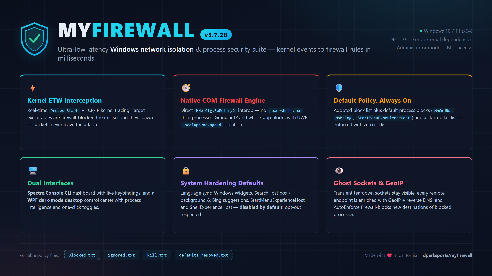
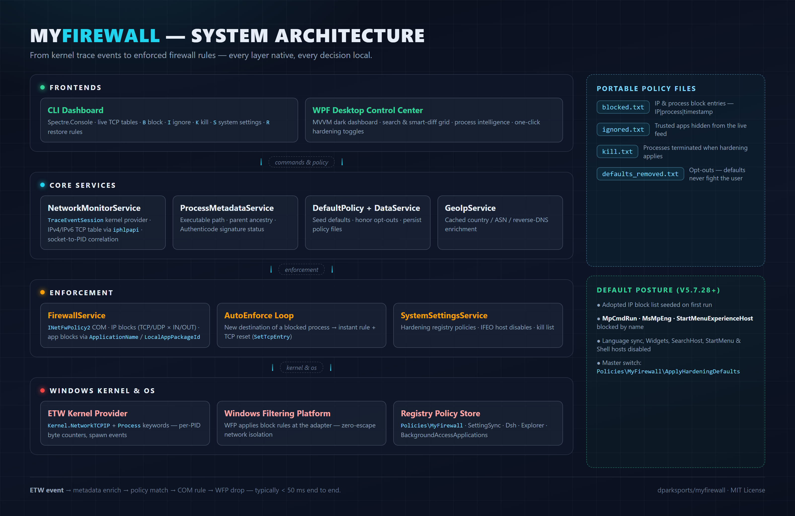

<p align="center">
  
</p>

# 🛡️ MyFirewall

**Ultra-low latency Windows network isolation & process security suite.**

MyFirewall watches the Windows kernel directly — every process start and every TCP/IP event streams through ETW in real time — and turns what it sees into enforced Windows Firewall rules through the native `INetFwPolicy2` COM API. No PowerShell child processes, no drivers to install, no cloud dependency in the enforcement path. It ships as two frontends over one engine: a **Spectre.Console CLI dashboard** and a **WPF dark-mode desktop control center**, both self-contained .NET 10 binaries for Windows 10/11 x64.

- **[Features](#-features)** · **[Default security posture](#-default-security-posture)** · **[Policy files](#-policy-files)** · **[CLI TUI](#%EF%B8%8F-cli-tui)** · **[Build](#-build--installation)** · **[Architecture](#-architecture)**

---

## ✨ Features

### ⚡ Real-time kernel event tracing (ETW)
- Captures `ProcessStart` and per-PID TCP/IP byte counters via a kernel `TraceEventSession`.
- **Zero-escape enforcement** — a firewall rule is applied the millisecond a target executable spawns, before its packets reach the adapter.
- IPv4 **and** IPv6 TCP tables read through `iphlpapi` with socket-to-PID correlation and ghost-socket tracking during teardown.

### 🧱 Native COM firewall engine
- Direct `HNetCfg.FwPolicy2` / `HNetCfg.FWRule` interop — rule add/remove/enumerate without spawning `powershell.exe`.
- IP blocks are created as four rules each (TCP/UDP × inbound/outbound); whole-application blocks resolve UWP **Package Family Names** and use native `LocalAppPackageId` isolation for system apps such as `StartMenuExperienceHost`.
- **AutoEnforce loop** — any new destination IP contacted by a blocked process is firewall-blocked instantly and its live sockets reset via `SetTcpEntry`.
- **App-level escalation** — the moment a process name is blocked, an ANY-protocol application rule is applied, so *every* destination (new IPs, UDP included) is blocked by the firewall itself; per-IP chasing becomes a safety net.
- **Event-driven enforcement** — ETW `TcpIpConnect` / `UdpIpSend` events fire enforcement in milliseconds (not on the next 2s scan), catching send-and-die beacons whose sockets never appear in a snapshot; a PID→image map keeps attribution alive after the process exits.
- **Reconciliation sweep** — every ~30s the app re-asserts blocked processes' app-level rules, repairing anything deleted by other tools.

### 🖥️ Two frontends, one engine
- **CLI dashboard** — cursor-driven live tables with tabs, filtering, overlay modals, and a color-coded alert log.
- **Desktop control center** — WPF dark dashboard with real-time search, smart-diff updates (no grid flicker), process ancestry, Authenticode signature status, and one-click hardening toggles.

### 🔍 Process intelligence
- Executable path resolution, parent process trees, and digital-signature verdicts for every connection.
- GeoIP + reverse-DNS enrichment with caching and throttling.
- Proactive WebView2 spawn analysis — every `msedgewebview2.exe` launch is attributed to its parent (Search UI, Widgets, Edge) and can be network-isolated app-wide with one toggle.

### 🔒 OS hardening controls
One-click, reversible registry-backed toggles for the noisy parts of Windows: **language sync, Windows Widgets, the taskbar SearchHost box, SearchHost background activity & Bing search suggestions, StartMenuExperienceHost, ShellExperienceHost**, plus a proactive outbound block for WebView2.

---

## 🛡️ Default security posture

MyFirewall does not start empty. A built-in **default policy** (single source of truth: [`MyFirewall.Desktop/Services/DefaultPolicy.cs`](MyFirewall.Desktop/Services/DefaultPolicy.cs), compiled into both frontends) is seeded on every launch:

| Default | Contents |
|---|---|
| **Blocked IPs** | The adopted block list — known Defender/GameBar/Widgets/SearchHost/StartMenu/WebView2 telemetry endpoints, seeded verbatim from the currently configured `blocked.txt` |
| **Blocked processes** | `MpCmdRun`, `MsMpEng`, `StartMenuExperienceHost` — blocked by name; every new destination they touch is firewall-blocked automatically |
| **Kill list** (`kill.txt`) | `SettingSyncHost`, `Widgets`, `SearchHost`, `StartMenuExperienceHost`, `ShellExperienceHost` — terminated when hardening applies |
| **Hardening defaults** | Language sync, Widgets, SearchHost box, SearchHost background & Bing search, StartMenuExperienceHost and ShellExperienceHost all **disabled** at startup |

**Defaults never fight the user.** Un-blocking a default entry records an opt-out in `defaults_removed.txt`, and manually changing any hardening toggle flips the master switch (`HKLM\SOFTWARE\Policies\MyFirewall\ApplyHardeningDefaults`) so startup stops re-asserting. Delete the opt-out (or set the value back to `1`) to return to the default posture.

---

## 📄 Policy files

All state lives next to the executable — portable, human-readable, no installer database:

| File | Format | Purpose |
|---|---|---|
| `blocked.txt` | `IP\|Process\|timestamp` (non-IP key = blocked process) | Firewall-block list; auto-enforced |
| `ignored.txt` | one app name per line | Trusted apps hidden from the live feed |
| `kill.txt` | one process name per line | Processes terminated when hardening defaults apply |
| `defaults_removed.txt` | `block:<key>` / `kill:<name>` | Your explicit opt-outs from the built-in defaults |

---

## 🖥️ CLI TUI

The CLI is a state-machine terminal app rendered as a single atomic frame (flicker-free `Live` rendering, no screen-clearing wizards): a **row cursor** over the live feed, **tabs**, an instant **filter**, and **overlay panels** for details, confirmations and help — the live feed keeps refreshing behind them.

**Tabs:** `1` All · `2` Outbound · `3` Inbound · `4` Blocked rules · `5` Ignored · `6` Alert log · `7` Domain cache · `S` System settings

| Key | Action |
|---|---|
| `↑`/`↓` / `PgUp`/`PgDn` | Move / page the row cursor (auto-scrolls) |
| `1`–`7`, `S` | Switch tab / open system settings |
| `Enter` / `P` | Threat-intelligence detail for the selected connection |
| `B` | Firewall-block the selected connection's IP |
| `K` | Kill the selected process tree (confirm overlay) |
| `I` | Ignore the selected process |
| `/` | Filter the live feed (process, IP, domain, geo) — `Esc` clears |
| `X` / `Space` / `A` | Remove / add entries on the Blocked & Ignored tabs |
| `C` | Clear the alert log |
| `T` | Toggle monitoring strategy (connection-driven ⇄ process-start ETW) |
| `R` | Restore hardcoded firewall rules (confirm overlay) |
| `H` / `F1` / `?` | Help overlay |
| `Q` | Graceful stop & exit |

```bash
MyFirewall.exe --refresh 3   # optional refresh interval in seconds
```

---

## 🏗️ Build & installation

**Requirements:** Windows 10/11 x64, .NET 10 SDK, Administrator privileges (ETW kernel sessions and firewall COM need elevation).

```powershell
git clone https://github.com/dparksports/myfirewall.git
cd myfirewall

# CLI
dotnet build MyFirewall.csproj -c Release

# WPF Desktop app
dotnet build MyFirewall.Desktop/MyFirewall.Desktop.csproj -c Release

# Self-contained single-file publish (both)
dotnet publish MyFirewall.csproj                -c Release -r win-x64 --self-contained -o ./publish/cli
dotnet publish MyFirewall.Desktop/MyFirewall.Desktop.csproj -c Release -r win-x64 --self-contained -o ./publish/desktop
```

Grab a ready-to-run build from the [Releases page](https://github.com/dparksports/myfirewall/releases) — each release ships `release_cli_win_x64.zip` and `release_desktop_win_x64.zip`, fully self-contained (no .NET install required). Run as Administrator.

### Automated release

```powershell
.\release.ps1 -BumpType Patch          # version bump → publish → zip → tag → GitHub release
.\release.ps1 -DryRun                  # preview without changes
```

Requires `GITHUB_TOKEN` (or `-Token`) for the release API call. A UAC manifest sidecar (`<App>.exe.manifest`) is copied next to each published binary so elevation survives single-file publish.

### Infographics

The banners in this README are generated from HTML sources with headless Edge:

```powershell
powershell -ExecutionPolicy Bypass -File assets\render_infographics.ps1
```

---

## 🏛️ Architecture

<p align="center">
  
</p>

```
Frontends        CLI (Spectre.Console)   ·   WPF Desktop (MVVM)
                     │  commands & policy
Core Services    NetworkMonitorService (ETW) · ProcessMetadataService · DefaultPolicy + DataService · GeoIpService
                     │  enforcement
Enforcement      FirewallService (INetFwPolicy2 COM) · AutoEnforce loop · SystemSettingsService (registry/IFEO)
                     │  kernel & OS
Windows          ETW kernel provider · Windows Filtering Platform · Registry policy store
```

---

## 📜 License

Distributed under the [Apache License 2.0](LICENSE).

<p align="center"><i>Made with ❤️ in California.</i></p>
